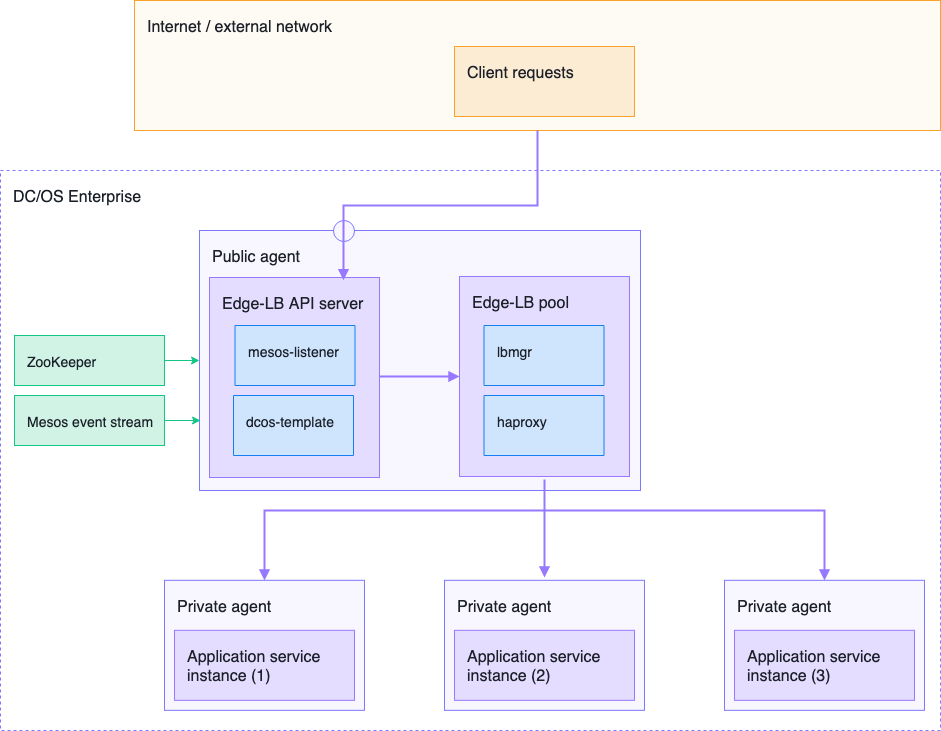

Edge-LB provides layer-7 inbound load balancing and proxying through the Edge-LB API server and Edge-LB pools. This section provides a deeper view into the details of the Edge-LB architecture and how it works.

The following diagram provides a more detailed representation of the Edge-LB architecture.

# A closer look at the Edge-LB API server
The Edge-LB API receives incoming client requests and, based on the action requested, creates, deletes, or updates Edge-LB pool instances. The API server also serves API endpoint requests for Edge-LB pool(s) instances.

The Edge-LB API server uses the DC/OS ZooKeeper persistent storage to store the configuration file for the load balancer and communicates to the Edge-LB pool instances through ZooKeeper transactions. The interaction between ZooKeeper and the Edge-LB API server enables Edge-LB to be fault tolerant. In the event of an API server failure, the Edge-LB pool instances continue to load-balance traffic to the proper backend. When the Edge-LB API server comes back online, it re-establishes the communication between itself and the pool instances.

The Edge-LB API server has two sub-components:
- Mesos listener
- DC/OS template

## Mesos listener
The `mesos-listener` sub-component is always up by default. It subscribes to the Mesos event stream, translates the event stream data into an internal data structure, and serves metadata from the data structure through the API server. It also runs a gRPC server to serve the Mesos task information to other Edge-LB components like the `dcos-template`.

## DC/OS template
The `dcos-template` sub-component dynamically renders the load balancer configuration information for HAProxy by combining the `mesos-listener` output and the Edge-LB pool configuration provided by the Edge-LB CLI client. The template then signals the `lbmgr` sub-component to take appropriate action on the HAProxy load balancer instance.

In the event of Edge-LB pool update, the `dcos-template` re-generates the HAProxy load balancer configuration from the Edge-LB pool configuration file and signals `lbmgr` to reload the existing HAProxy configuration in real-time.

# A closer look at Edge-LB pools
The Edge-LB pool provides the core load balancing functionality for Edge-LB software.
However, there are no Edge-LB pool instances created by default.
To create a pool instance, you must define configuration settings in a pool configuration file.
You can set up load balancing for one service or for multiple services using the same pool configuration file, depending on your application and network requirements.

Edge-LB pool has two sub-components:
- Load balancing manager (lbmgr)
- HAProxy

## Load balancer manager (lbmgr)

The load balancing manager (`lbmgr`) in Edge-LB pool instances is a non-distributed process that runs along with the HAProxy load balancer. `lbmgr` takes the appropriate action for the pool when it receives requests from the API server.

The `lbmgr` component monitors the HAProxy instances for the Edge-LB pool and restarts HAProxy in the same container, when needed. For example, if an HAProxy instance goes down because an agent is disconnected, the `lbmgr` process creates a new HAProxy instance to replace it on another available agent.

The `lbmgr` component also validates new load balancer configuration settings and reloads HAProxy load balancer instances, when necessary. For example, the `lbmgr` component manages the timeout interval for reloading the HAProxy instance.

## HAProxy instances

Individual HAProxy instances provide the proxying and load balancing functionality for Edge-LB to the proper backend services.
